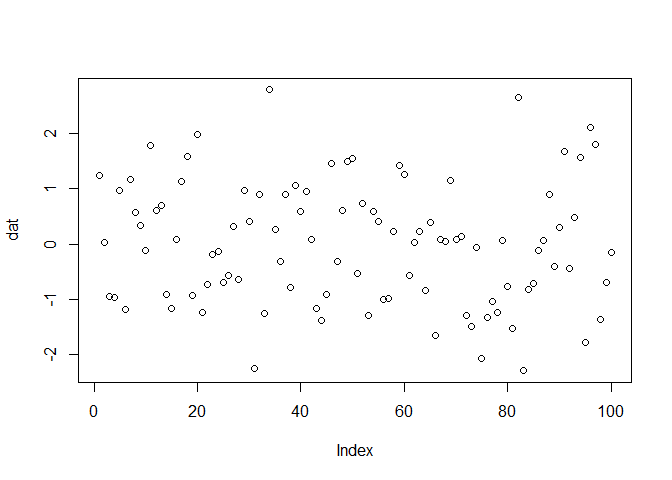

## Learning GitHub actions

In my attempt to lear github actions here are some of the resources so
far I have come across.

-   [doc.github.com](https://docs.github.com/en/actions/learn-github-actions/understanding-github-actions#viewing-the-jobs-activity) -
    Understanding GitHub Actions

-   [The
    Distillery](https://distillery.rbind.io/posts/2021-03-18-use-github-actions-with-r-markdown-and-distill/) -
    Use GitHub actions with R Markdown and Distill

------------------------------------------------------------------------

### Testing

2021-09-24 08:29:11

``` r
dat=rnorm(100)

plot(dat)
```

<!-- -->
